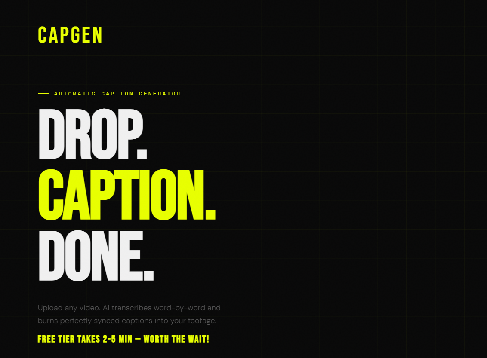
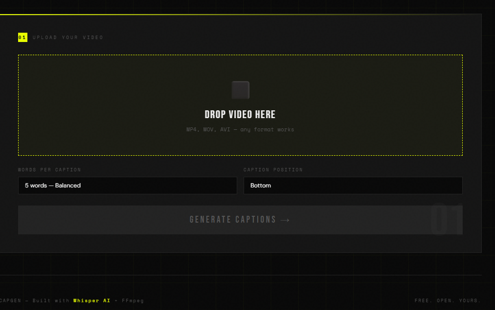
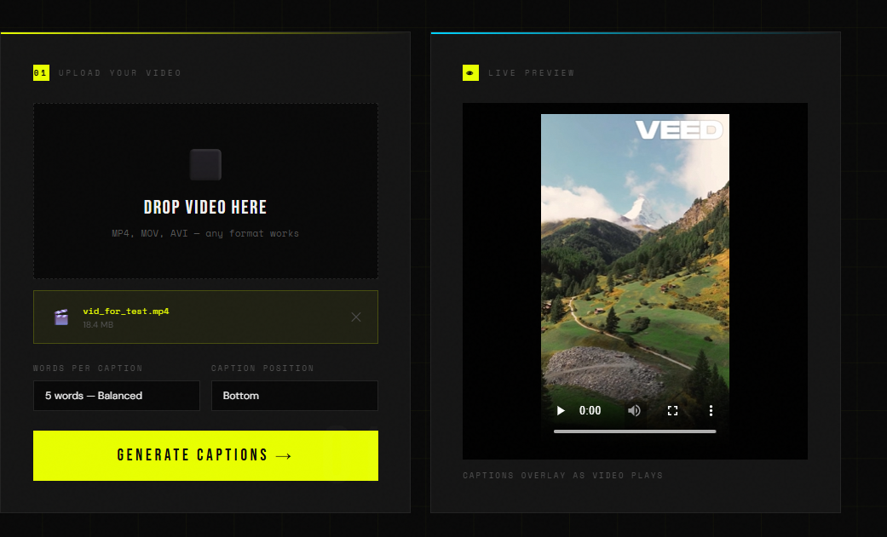
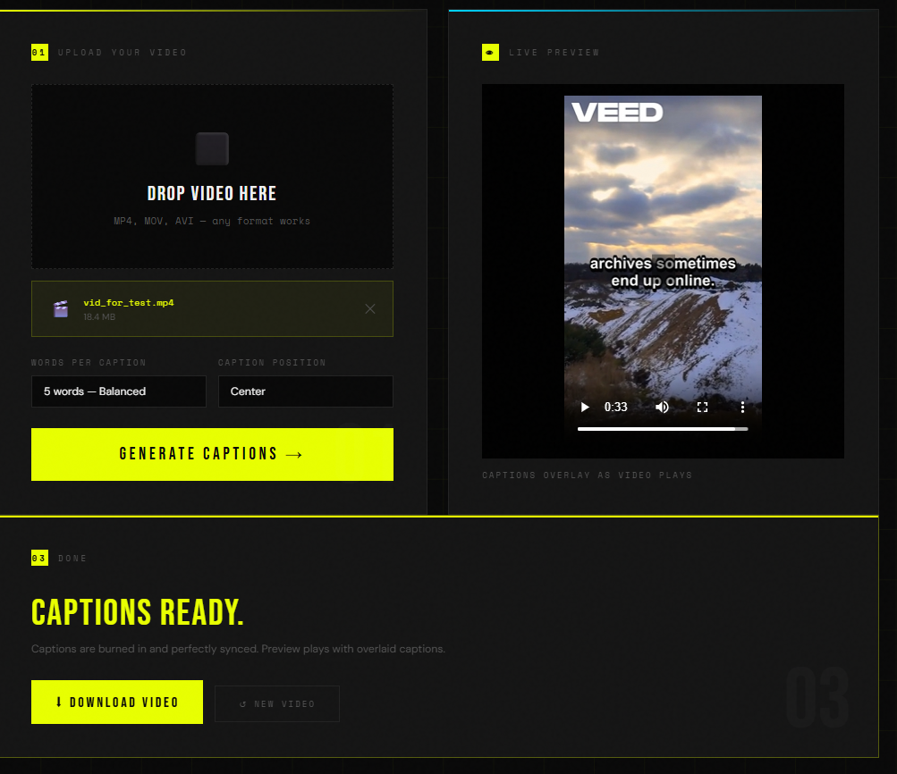

# CAPGEN — AI Caption Generator



> Upload any video. AI transcribes word-by-word and burns perfectly synced captions directly into your footage.

**Live Demo:** [caption-generator-1-2qhe.onrender.com](https://caption-generator-1-2qhe.onrender.com)

---

## Screenshots







---

## Overview

CAPGEN is a full-stack AI web application that automatically generates and burns captions into videos. Users upload a video, the AI transcribes the speech with word-level timestamps, and FFmpeg burns perfectly synced captions directly into the video frames — no manual editing required.

Built from scratch in one day as a learning project. Zero to fully deployed AI SaaS product.

---

## Features

- Upload any video format — MP4, MOV, AVI
- AI transcription powered by Groq Whisper large-v3
- Word-level timestamps for perfectly synced captions
- Captions permanently burned into video frames
- Live browser preview with caption overlay before downloading
- Customizable words per caption and caption position
- No watermark, no signup required

---

## Tech Stack

| Layer | Technology |
|---|---|
| Backend | Python + Flask |
| AI Transcription | Groq Whisper large-v3 API |
| Video Processing | FFmpeg via imageio-ffmpeg |
| Frontend | HTML, CSS, Vanilla JavaScript |
| Typography | Bebas Neue, DM Sans, Space Mono |
| Deployment | Render |
| Version Control | Git + GitHub |

---

## Architecture

```
User uploads video
        |
        v
FFmpeg extracts audio track
        |
        v
Groq Whisper API — word-level timestamp transcription
        |
        v
Python groups words into timed caption chunks → .srt file
        |
        v
FFmpeg burns captions into video frames
        |
        v
User downloads captioned video
```

---

## Project Structure

```
caption_generator/
|
|-- app.py                  # Flask backend — routes and pipeline
|-- requirements.txt        # Python dependencies
|-- render.yaml             # Render deployment config
|-- .gitignore
|
└-- templates/
    └-- index.html          # Frontend UI
```

---

## Local Setup

### Prerequisites

- Python 3.10+
- Git

### Installation

```bash
# Clone the repository
git clone https://github.com/Samarth-S-Shetty/caption_generator.git
cd caption_generator

# Create virtual environment
python -m venv .venv

# Activate — Windows
.venv\Scripts\activate

# Activate — Mac/Linux
source .venv/bin/activate

# Install dependencies
pip install -r requirements.txt
```

### Environment Variables

Create a `.env` file in the root directory:

```
GROQ_API_KEY=your_groq_api_key_here
HF_API_KEY=your_huggingface_api_key_here
```

Get your free API keys:
- Groq — [console.groq.com](https://console.groq.com)
- HuggingFace — [huggingface.co/settings/tokens](https://huggingface.co/settings/tokens)

### Run

```bash
python app.py
```

Visit `http://127.0.0.1:5000`

---

## API Reference

| Method | Endpoint | Description |
|---|---|---|
| GET | `/` | Frontend UI |
| POST | `/generate` | Accepts video, runs full pipeline |
| GET | `/get-video` | Returns processed captioned video |
| GET | `/get-srt` | Returns generated .srt caption file |
| GET | `/sitemap.xml` | SEO sitemap |

---

## Deployment

Deployed on Render. Key notes:

- Uses `imageio-ffmpeg` which bundles its own FFmpeg binary — no system FFmpeg install needed
- Environment variables configured via Render dashboard
- Auto-deploys on every push to `main` branch

---

## Roadmap

- [x] Core caption generation pipeline
- [x] Word-level timestamp sync
- [x] Live video preview with caption overlay
- [x] Production deployment
- [ ] User authentication — MongoDB + Flask-Login
- [ ] Usage tracking per user
- [ ] Stripe paywall integration
- [ ] Custom caption styling — font, color, size
- [ ] Multi-language support

---

## License

MIT License

---

## Author

**Samarth S Shetty**

[github.com/Samarth-S-Shetty](https://github.com/Samarth-S-Shetty)